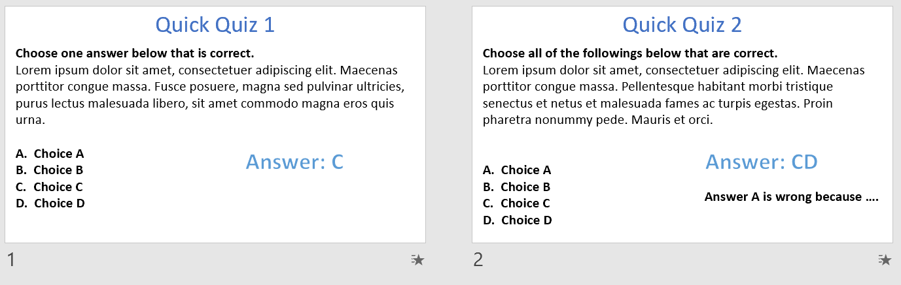
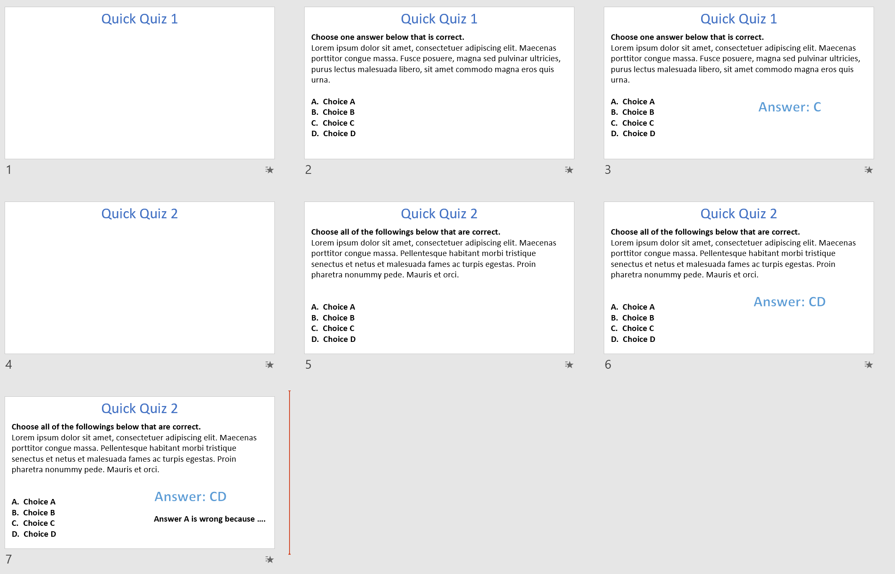

# PPT to PDF with Breaks

This is a simple project that turns PowerPoint Slides into PDF files with mouse-click-triggered animations turned into page separators. 

## How to Use

- Open PowerPoint and turn to `Developer` tab in the ribbon
- Click `Visual Basic`
- Click `File - Import File`, choose the `addBreak.bas` file in this repository.
- Turn back to PowerPoint window and click `Macros`
- Click `addAnimationBreaks` and `Run` at the right side.
- It is done! 

## Notice

After running the macro, your file opened will be `backup.pptx`, remember to open back your original file!

## Demo

This repository comes with a sample called `sample.pptx` , which demonstrated one scenario that this product is used, and the PDF file exported from it, you may also try it yourself. You may also see the images below:
### Before

### After

## Have Fun!
